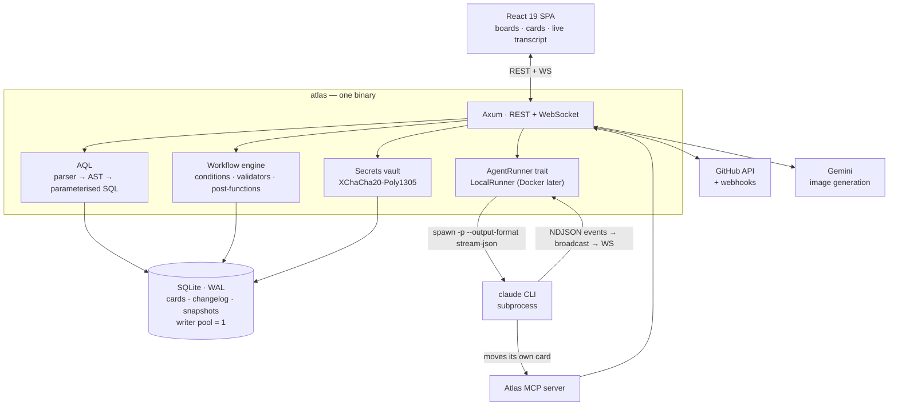

# Atlas

A self-hosted project tracker where **a card is an agent task**.

> **Status: under construction.** Phase 0 of 20 — the foundation is being laid and Atlas does
> not run yet. [`TODO.md`](TODO.md) is the plan and the honest progress table. This README
> describes what is being built, in present tense, because that is what a README is for. It is
> not a claim that it works today.

---

## Why this exists

Working with a coding agent means re-briefing it constantly. What the project is, what the
task is, what "done" looks like, which repo, which branch — typed again, in prose, every
time. Meanwhile the same information already exists, structured, on a board somewhere. The
tickets *are* the tasks. They just live in a system that has never heard of the agent.

Atlas collapses the two. You create a project and its board together, and **"Run with Claude"
is a button on the card**. The card's summary, description, and acceptance criteria are the
prompt. The linked repo is the working directory. There is no briefing step, because the
briefing is the card — which you were going to write anyway.

When the run finishes, the agent posts a transcript summary as a comment, attaches the branch
and PR, and **moves its own card**. Atlas exposes an MCP server (`atlas_move_card`,
`atlas_set_status`, `atlas_comment_card`, …) so the agent updates the board as a first-class
participant rather than being narrated by a wrapper script watching stdout.

The other half matters just as much: **Atlas is a real tracker, not an agent toy.** Nothing in
the core assumes software. Job search and 3D modeling boards are equal citizens of the domain
model — a deliberate constraint that shaped the schema, not a marketing line.

## What's different

**Recursive boards.** A card can contain its own board. Not a special "sub-board" feature —
hierarchy is a uniform `parent_id` plus a per-project level table, so *a board is just a view
over a parent's children*. Nested boards fall out of the model. Jira hardcodes three levels,
special-cases sub-tasks, and paywalls anything above Epic; Atlas has no level names in the
code at all. Cards holding a board render a **mini-map** of it, so the nesting is visible at a
glance. → [ADR-0002](docs/adr/0002-recursive-hierarchy-not-hardcoded-levels.md)

**Claude Code sessions bound to cards.** Spawned per card, streamed live to the browser
(transcript, tool calls, token and cost meter, cancel button), resumable across restarts, with
per-project permission modes and a real cost dashboard. → [ADR-0005](docs/adr/0005-local-subprocess-agent-runner.md)

**GitHub, on the card.** Create a branch from a card (`feature/ATLAS-42-add-login`), open a PR
from it, and see branches, commits, checks, and PR state on the card itself. Smart commits
(`ATLAS-42 #done #time 2h`) transition cards from commit messages. → [ADR-0006](docs/adr/0006-pat-now-github-app-later.md)

**Gemini image generation.** Project cover art and avatars generated from the project's name
and type; card covers; reference images for 3D work.

**AQL.** A real query language — a hand-written recursive-descent parser to an AST to
*parameterised* SQL. Boards, filters, dashboards, gadgets, quick filters, automation, and
reports are all AQL plus a renderer, which is why it gets built early and properly.

**And the parts everyone underrates:** free-text tags, a `.` command palette, undo on
destructive operations, a full changelog behind every card, permanent redirects for moved card
keys, attachment versioning, and "don't notify me of my own changes" on by default.

Some things are **deliberately cut**: permission schemes, notification schemes, screen schemes,
issue-type schemes, and the rest of Jira's configuration indirection. Each is a considered
decision, listed in `TODO.md`. → [ADR-0003](docs/adr/0003-collapse-jira-scheme-layer.md)

## Architecture

| Layer | Choice | Why |
|---|---|---|
| Backend | Rust + Axum 0.8 | One static binary; real subprocess control for the agent runner |
| Database | SQLite (WAL) + SQLx 0.9 | Single file, no daemon, backup is a file copy; SQL checked at compile time |
| Frontend | React 19 + TypeScript + Vite | Types generated from the backend's OpenAPI schema |
| Drag & drop | pragmatic-drag-and-drop | Atlassian's own, open-source — what Jira and Trello actually ship |
| Search | SQLite FTS5 | Bundled with SQLx; no extension to install |
| Agent runner | local `claude` CLI subprocess | Behind a trait, so a Docker runner can swap in later |
| GitHub auth | PAT, encrypted at rest | Webhook receiver built now so a GitHub App drops in later |
| Secrets | XChaCha20-Poly1305 | Redacted `Debug`, `zeroize` on drop — leaking a key is a compile error |



The loop worth tracing: **Browser → API → Runner → `claude` → MCP → API → Browser.** The agent
reaches back into Atlas through the MCP server and moves the card it was given. That cycle is
the product.

## Quickstart

**Prerequisites**

- Rust ≥ 1.94 (SQLx 0.9's MSRV) — [rustup.rs](https://rustup.rs)
- Node ≥ 22
- [`just`](https://just.systems) — or use `make`, every target is mirrored
- `sqlx-cli`, for migrations:
  ```sh
  cargo install sqlx-cli --version 0.9.0 --no-default-features --features sqlite
  ```
  No `--locked` — SQLx 0.9 removed `Cargo.lock` from the published crate.
- Optional: the [`claude` CLI](https://claude.com/claude-code), for agent sessions

**Run it**

```sh
git clone https://github.com/alastairrayner/atlas.git
cd atlas
cp .env.example .env      # then edit it

just migrate              # create the database, apply migrations
just seed                 # default admin, project templates, tag presets
just dev                  # backend :8080 + frontend :5173, together
```

Open **http://localhost:5173** in development (Vite proxies the API), or **http://localhost:8080**
for the server on its own.

**First login is `Admin` / `Admin`, and Atlas forces a password change immediately.** Every
route except logout and change-password returns 403 until you do, and the old password cannot
be reused. This is a fresh-install convenience, not a default credential left lying around.

**Or with Docker**

```sh
cp .env.example .env
mkdir -p data workspaces && sudo chown -R 10001:10001 data workspaces
docker compose up -d      # http://localhost:8080
```

`./data` holds the SQLite database and **must** be a volume — an unmounted `/data` means the
database dies with the container. `./workspaces` holds the agent's repo clones.

## Working on it

```sh
just              # list every target
just check        # the pre-PR gate: fmt-check + lint + test
just test         # cargo test + vitest
just prepare      # regenerate .sqlx/ offline metadata — commit the result
just gen-api      # regenerate the typed frontend client (needs the backend running)
```

Two rules the build enforces and CI will catch:

- **`.sqlx/` must be current.** CI has no database, so query macros compile against committed
  offline metadata. Change a query, run `just prepare`, commit it.
- **Work happens on `feat/NN-slug`** and merges to `main` via PR once CI is green.

## Project layout

```
atlas/
├── backend/            # Rust: Axum server, AQL, workflow engine, agent runner
│   └── migrations/     # SQLx migrations (reversible)
├── frontend/           # React 19 + TypeScript + Vite
│   └── src/api/        # generated from the backend's OpenAPI schema — don't hand-edit
├── docs/
│   ├── adr/            # architecture decision records
│   └── research/       # API and design dossiers + corrections.md
├── .sqlx/              # SQLx offline metadata — generated, committed, must stay current
├── data/               # SQLite database (gitignored, volume in Docker)
├── workspaces/         # agent repo clones (gitignored)
├── justfile            # task runner  ·  Makefile mirrors it
├── Dockerfile          # multi-stage: node → rust → debian-slim
└── TODO.md             # the plan, all 20 phases
```

## Documentation

- **[`TODO.md`](TODO.md)** — the full implementation plan, 20 phases, with the architecture
  decisions that dominate everything else and an explicit list of what was cut and why.
- **[`docs/adr/`](docs/adr/)** — architecture decision records: the choices that were expensive
  to make, and what each one costs.
- **[`docs/research/`](docs/research/)** — deep dossiers on the Jira feature surface, the
  Atlassian Design System, the Claude Code CLI, the GitHub and Gemini APIs, and the Rust and
  React stacks.
- **[`docs/research/corrections.md`](docs/research/corrections.md)** — **read this one.** An
  adversarial pass tried to refute the research agents' claims; twelve did not survive. Each is
  recorded because each was plausible enough that it would otherwise have been implemented
  verbatim. It is the most useful file in the repository.

## Licence

Not yet chosen.
